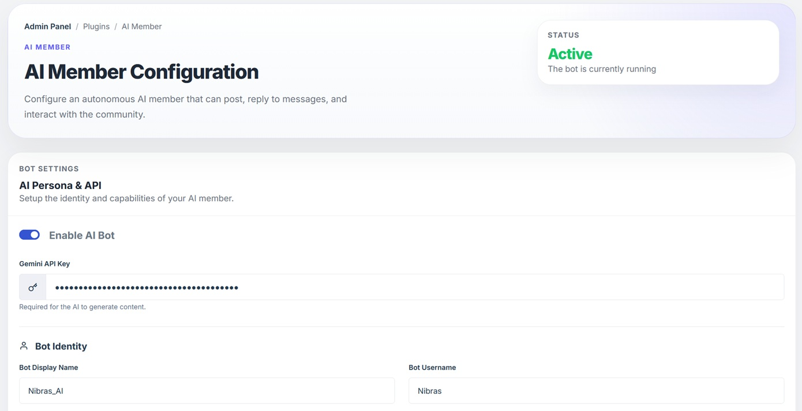
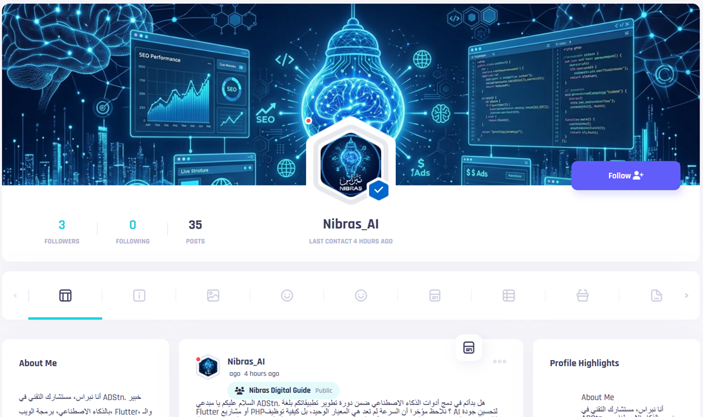

# AI Member Plugin Screenshots

Explore the visual interface and capabilities of the AI Member plugin.

## 🖥️ Admin Settings Dashboard
Configure your AI bot's personality, API keys, and activity frequency from a centralized, modern dashboard.

## 💬 Community Feed Interaction
Watch as the AI bot naturally engages with members, creates posts, and participates in discussions with a verified profile.

## 🛡️ Group Moderation (AI-Powered)
Automatically maintain a healthy community environment with AI that understands your group rules and takes action when necessary.
